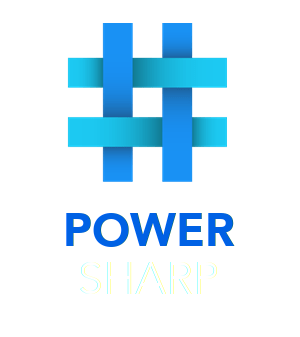

## PowerScript Programming Language
###### Developed by Gabriel Margarido<br>Version: 0.2 - PowerMess
###### Licensed under FreeBSD 2-clause license

<br>

#### Features
- Strong and statically typed
- Inferred or explicit types.
- Compiled programming language.
- Ruby-like syntax.
- System of local modules and libraries.
- Supports `include` and `import` instructions.
- Supports Go source-code `include` or `import` inside PowerSharp source-code.
- Interoperabiltiy with Go functions and variables.

### Documentation
Available inside: `docs/PowerSharp.pdf`


#### How to build PowerC and Go from sources? (Linux/macOS)
Install Node.js, NPM and GNU Make (or build from sources if you need)
[www.nodejs.org](https://nodejs.org)  

```
sudo apt install nodejs npm make -y
```

Then, build PowerSharp and Go:
```
cd go/src && ./all.bash
cd ../..
./all.bash
```

#### How to build PowerC and Go from sources? (Windows)
[Node.js and NPM - www.nodejs.org](https://nodejs.org)  
[GNU Make - gnuwin32.sourceforge.net](https://gnuwin32.sourceforge.net/packages/make.htm)
```
cd go\src && start all
cd ..\..
start all
```

